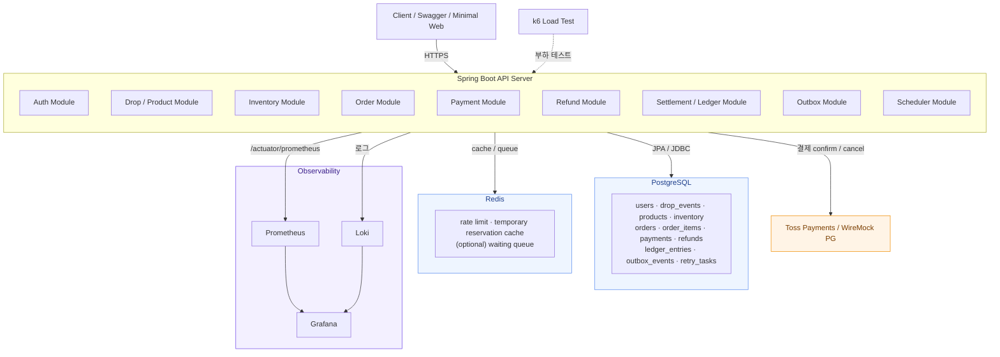

  

<em><b>SpikeDrops:</b> 한정 수량 상품, 티켓, 굿즈, 수강권 등 특정 시점에 대량 트래픽이 몰리는 “드롭 판매” 상황을 가정한 결제 백엔드 데모 프로젝트</em>

---

한정 수량 드롭 판매 상황에서 **동시 주문 · 결제 승인 · 주문 만료**가 충돌하는 문제를 재현하고, 트랜잭션 경계 분리와 락 전략 최적화로 **재고 정합성**과 **DB 성능**을 개선하는 결제 백엔드 토이 프로젝트입니다. **상용 서비스가 아닙니다.**

## Tech stack

- **Backend** — Java 21, [Spring Boot 4.0.6](https://spring.io/projects/spring-boot), Spring Web MVC, Spring Data JPA, Spring Security (OAuth2 Resource Server), Bean Validation, Lombok
- **Database** — [PostgreSQL](https://www.postgresql.org/) + [Flyway](https://flywaydb.org/) migration
- **Cache / Queue 보조** — [Redis](https://redis.io/) (rate limit, 임시 예약 캐시, optional waiting queue)
- **Payment** — [Toss Payments](https://docs.tosspayments.com/) 테스트 연동 또는 [WireMock](https://wiremock.org/) 기반 PG Mock (`wiremock-spring-boot`)
- **API Docs** — [springdoc-openapi](https://springdoc.org/) (Swagger UI), [Spring REST Docs](https://spring.io/projects/spring-restdocs) + Asciidoctor
- **Test** — JUnit 5, [Testcontainers](https://java.testcontainers.org/) (PostgreSQL), [k6](https://k6.io/) 부하 테스트
- **Monitoring** — Spring Boot Actuator, Micrometer, Prometheus, Grafana, Loki (또는 ELK/EFK)
- **Infra** — Docker Compose, GitHub Actions, Spring Boot Docker Compose 지원

## 시스템 아키텍처

## 서비스 시나리오

1. 관리자가 한정 수량 상품을 등록한다.
2. 판매 시작 시간이 되면 사용자가 동시에 상품 주문을 요청한다.
3. 서버는 재고를 예약하고 주문을 생성한다.            (available → reserved)
4. 사용자가 PG 결제를 진행한다.
5. 결제 승인 callback / confirm 요청이 서버로 들어온다.
6. 서버는 결제 승인 결과를 반영하고 재고를 확정한다.   (reserved → sold)
7. 결제하지 않은 주문은 일정 시간 후 만료된다.        (reserved → available)
8. 환불 요청 시 결제 취소, 재고 복구, ledger 기록, outbox event를 처리한다.

### 핵심 비즈니스 규칙

- 재고는 음수가 될 수 없으며 (`available_quantity >= 0`), 초과 판매를 허용하지 않는다.
- 같은 결제/환불 요청은 여러 번 들어와도 한 번만 반영한다 (`idempotency_key` UNIQUE).
- **외부 PG 호출은 DB transaction 내부에서 수행하지 않는다.** lock hold time과 connection 점유를 최소화하기 위함.
- 주문 만료 스케줄러는 결제 승인 흐름과 충돌하지 않아야 한다 (상태 조건 + row lock + `SKIP LOCKED`).

## 모니터링

Spring Boot Actuator + Micrometer + Prometheus + Grafana stack

- **Application** — endpoint별 RPS, p50/p95/p99 latency, error rate, JVM/GC, HikariCP active/idle/pending, transaction duration, external PG latency
- **Database** — `pg_stat_statements` 기준 slow query top N, lock wait count/time, deadlock count, seq scan / index scan, rows read vs returned, long transaction
- **Business** — oversell count (=0 검증용), reserved stock, expired order, duplicated payment request, payment confirm retry, outbox backlog, retry task backlog, refund failure

## 트러블슈팅

`docs/` 디렉터리에 추가 예정
