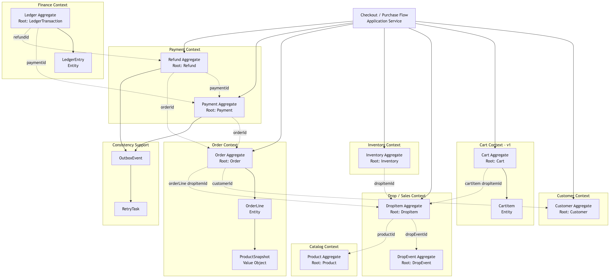

# SpikeDrops Pay Domain Model

## 1. Aggregate Overview

| 영역        | Aggregate Root      | 내부 구성                          | 단계   |
|-----------|---------------------|--------------------------------|------|
| Customer  | `Customer`          | -                              | MVP  |
| Catalog   | `Product`           | -                              | MVP  |
| Drop      | `DropEvent`         | -                              | MVP  |
| Drop      | `DropItem`          | -                              | MVP  |
| Inventory | `Inventory`         | -                              | MVP  |
| Cart      | `Cart`              | `CartItem`                     | v1   |
| Order     | `Order`             | `OrderLine`, `ProductSnapshot` | MVP  |
| Payment   | `Payment`           | -                              | MVP  |
| Refund    | `Refund`            | -                              | v1   |
| Finance   | `LedgerTransaction` | `LedgerEntry`                  | v1   |
| Support   | `OutboxEvent`       | -                              | v1   |
| Support   | `RetryTask`         | -                              | v1   |

## 2. Aggregate Boundary Diagram



## 3. Aggregate Details

### 3.1 Customer Aggregate

사용자 식별 정보와 계정 상태를 관리한다.

```text
Customer
- id
- email
- name
- status
```

다른 Aggregate는 `Customer` 객체를 직접 소유하지 않고 `customerId`로 참조한다.

### 3.2 Product Aggregate

상품의 기본 카탈로그 정보를 관리한다.

```text
Product
- id
- name
- description
- basePrice
- status
```

재고는 `Product`가 아니라 `DropItem` 기준의 `Inventory`에서 관리한다.

### 3.3 DropEvent Aggregate

드롭 판매 이벤트의 기간과 상태를 관리한다.

```text
DropEvent
- id
- name
- startAt
- endAt
- status
```

### 3.4 DropItem Aggregate

특정 `DropEvent`에서 판매되는 상품을 표현한다.

```text
DropItem
- id
- dropEventId
- productId
- salePrice
- purchaseLimitPerUser
- status
```

`DropItem`은 `DropEvent`와 `Product`를 객체로 소유하지 않고 ID로 참조한다.

### 3.5 Inventory Aggregate

`DropItem` 단위의 판매 재고를 관리한다.

```text
Inventory
- id
- dropItemId
- totalQuantity
- availableQuantity
- reservedQuantity
- soldQuantity
- version
```

`Inventory`는 장바구니 품목이 아니다. `CartItem`은 사용자의 임시 구매 의사이고, `Inventory`는 실제 판매 가능 수량과 예약/판매 확정 수량을 관리한다.

### 3.6 Cart Aggregate - v1

사용자의 checkout 전 임시 구매 목록을 관리한다.

```text
Cart
- id
- customerId
- status
- expiresAt
- version
```

```text
CartItem
- id
- dropItemId
- quantity
- productNameSnapshot
- salePriceSnapshot
- status
```

`Cart`는 `CartItem`을 소유한다. `CartItem`은 `DropItem`, `Product`, `Inventory`를 객체로 소유하지 않는다.

### 3.7 Order Aggregate

주문과 주문 라인을 관리한다.

```text
Order
- id
- orderNo
- customerId
- status
- totalAmount
- expiresAt
- version
```

```text
OrderLine
- id
- dropItemId
- productSnapshot
- quantity
- unitPrice
- totalPrice
```

```text
ProductSnapshot
- productId
- productName
- unitPrice
```

`Order`는 `OrderLine`을 소유한다. `ProductSnapshot`은 주문 당시 표시 정보를 보존하기 위한 Value Object다.

### 3.8 Payment Aggregate

결제 상태와 결제 승인 멱등성을 관리한다.

```text
Payment
- id
- orderId
- paymentKey
- idempotencyKey
- method
- status
- amount
- transactionId
- approvedAt
- version
```

`Payment`는 `Order`와 DB상 1:1 관계에 가깝지만 별도 Aggregate로 둔다.

### 3.9 Refund Aggregate - v1

환불 요청과 환불 상태를 관리한다.

```text
Refund
- id
- orderId
- paymentId
- refundKey
- idempotencyKey
- amount
- status
- reason
- version
```

### 3.10 Ledger Aggregate - v1

결제와 환불의 금전 기록을 관리한다.

```text
LedgerTransaction
- id
- referenceType
- referenceId
- type
- status
- occurredAt
```

```text
LedgerEntry
- id
- amount
- direction
- accountType
```

### 3.11 Outbox / Retry Support Model - v1

도메인 변경 이후의 후속 작업을 안정적으로 처리하기 위한 지원 모델이다.

```text
OutboxEvent
- id
- aggregateType
- aggregateId
- eventType
- payload
- status
```

```text
RetryTask
- id
- taskType
- referenceId
- status
- retryCount
- nextRetryAt
```

## 4. Aggregate Reference Rule

1. Aggregate 간에는 객체 참조보다 ID 참조를 우선한다.
2. `Cart`와 `Order`는 별도 Aggregate이다.
3. `CartItem`은 `DropItem`을 `dropItemId`로 참조한다.
4. `OrderLine`은 `DropItem`을 `dropItemId`로 참조하고, 상품 표시 정보는 `ProductSnapshot`으로 보관한다.
5. `Inventory`는 `DropItem`을 `dropItemId`로 참조한다.
6. `Payment`는 `Order`를 `orderId`로 참조한다.
7. `Refund`는 `Order`, `Payment`를 각각 `orderId`, `paymentId`로 참조한다.
8. 여러 Aggregate를 함께 변경하는 유스케이스는 Application Service가 조율한다.

## 5. Scope

### MVP

```text
Customer
Product
DropEvent
DropItem
Inventory
Order
Payment
```

### v1

```text
Cart
Refund
Ledger
OutboxEvent
RetryTask
```