# SpikeDrops Pay State Machine

## 1. Scope

### MVP

```text
DropEventStatus
DropItemStatus
Inventory quantity transition
OrderStatus
PaymentStatus
```

### v1

```text
CartStatus
CartItemStatus
RefundStatus
LedgerTransactionStatus
OutboxEventStatus
RetryTaskStatus
```

## 2. DropEventStatus

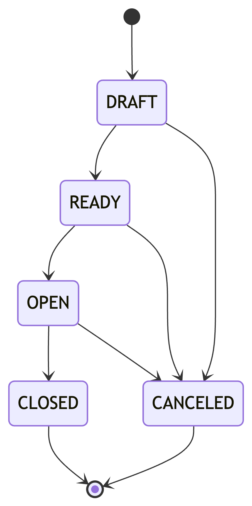

| 상태         | 의미       |
|------------|----------|
| `DRAFT`    | 작성 중     |
| `READY`    | 판매 준비 완료 |
| `OPEN`     | 판매 중     |
| `CLOSED`   | 정상 종료    |
| `CANCELED` | 취소       |

## 4. DropItemStatus

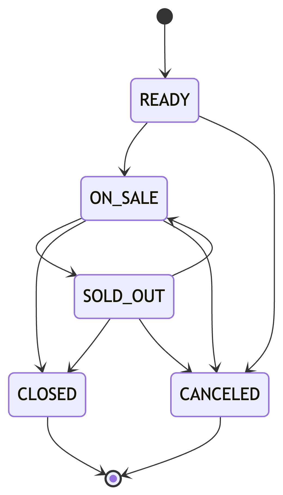

| 상태         | 의미       |
|------------|----------|
| `READY`    | 판매 준비    |
| `ON_SALE`  | 판매 중     |
| `SOLD_OUT` | 가용 재고 없음 |
| `CLOSED`   | 판매 종료    |
| `CANCELED` | 판매 취소    |

## 5. Inventory Quantity Transition

`Inventory`는 단일 상태 enum보다 수량 버킷 전이로 표현한다.

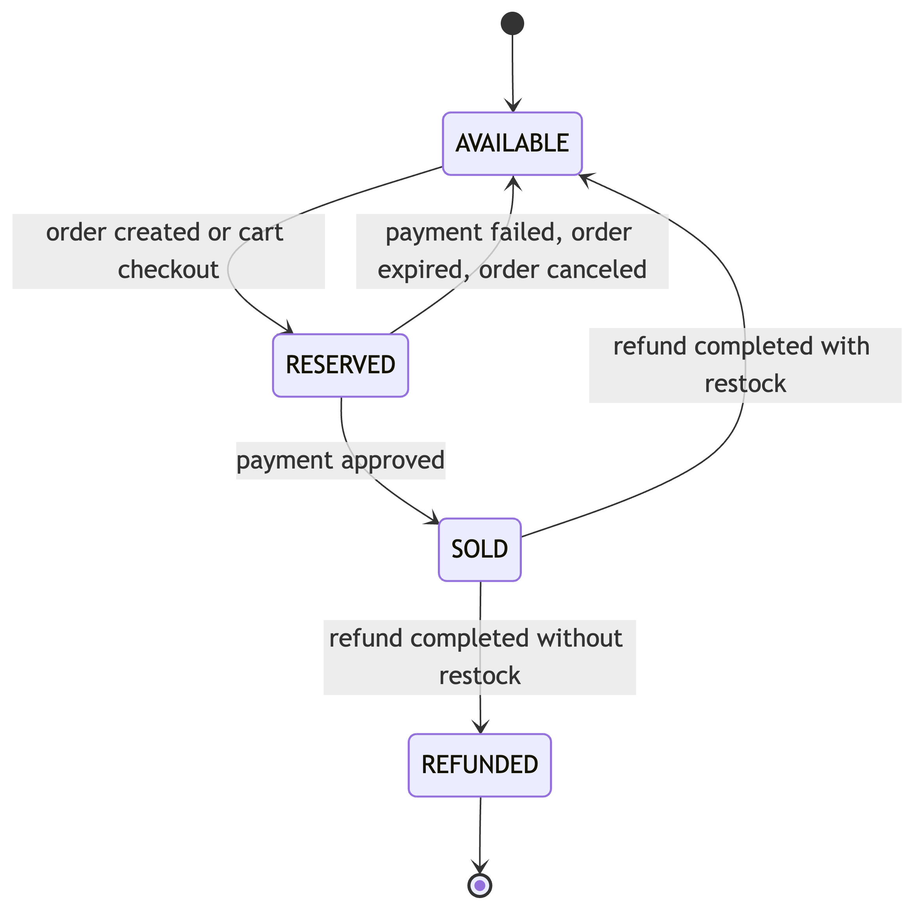

### Invariant

```text
totalQuantity = availableQuantity + reservedQuantity + soldQuantity
availableQuantity >= 0
reservedQuantity >= 0
soldQuantity >= 0
```

## 6. CartStatus - v1

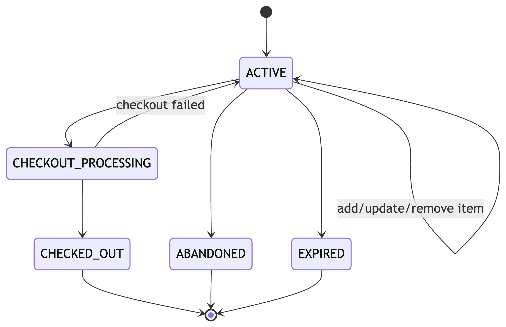

| 상태                    | 의미            |
|-----------------------|---------------|
| `ACTIVE`              | 수정 가능한 장바구니   |
| `CHECKOUT_PROCESSING` | checkout 처리 중 |
| `CHECKED_OUT`         | 주문으로 변환 완료    |
| `ABANDONED`           | 장기 미사용        |
| `EXPIRED`             | 만료            |

### 금지 전이

```text
CHECKED_OUT -> ACTIVE
ABANDONED -> CHECKOUT_PROCESSING
EXPIRED -> CHECKOUT_PROCESSING
```

## 7. CartItemStatus - v1

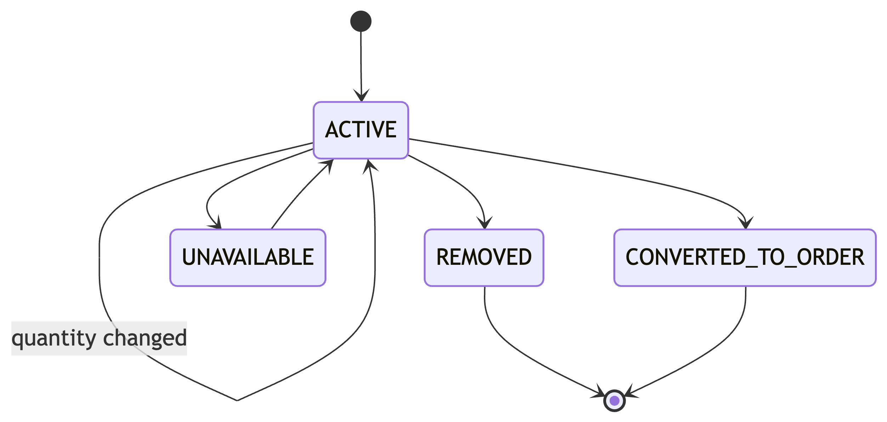

| 상태                   | 의미                        |
|----------------------|---------------------------|
| `ACTIVE`             | checkout 후보               |
| `REMOVED`            | 사용자가 제거                   |
| `UNAVAILABLE`        | 품절, 판매 종료 등으로 checkout 불가 |
| `CONVERTED_TO_ORDER` | 주문 라인으로 변환 완료             |

## 8. OrderStatus

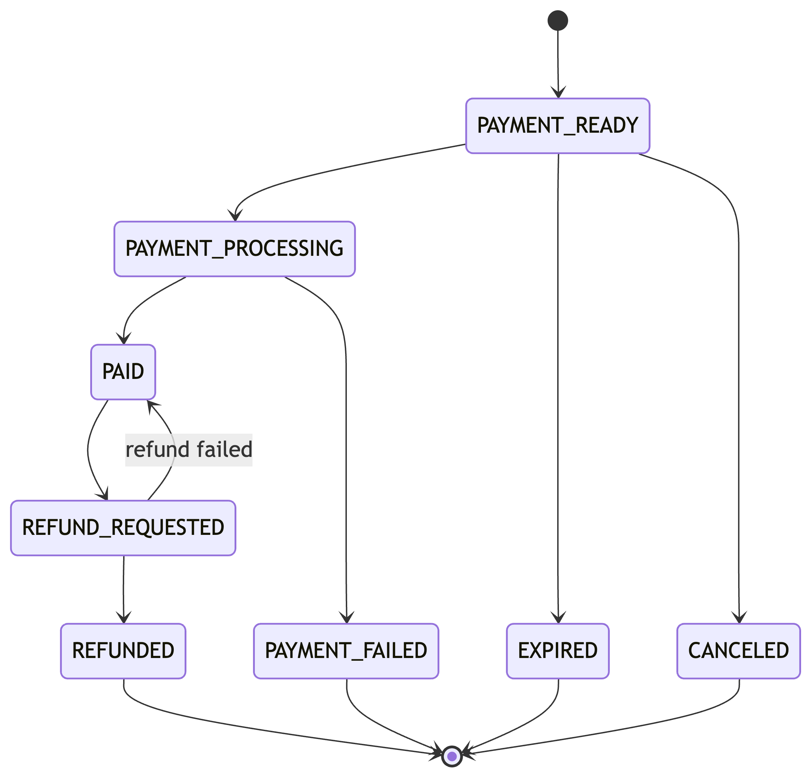

| 상태                   | 의미                      |
|----------------------|-------------------------|
| `PAYMENT_READY`      | 주문 생성 및 재고 예약 완료, 결제 대기 |
| `PAYMENT_PROCESSING` | 결제 승인 처리 중              |
| `PAID`               | 결제 완료                   |
| `PAYMENT_FAILED`     | 결제 실패                   |
| `EXPIRED`            | 주문 만료                   |
| `CANCELED`           | 결제 전 취소                 |
| `REFUND_REQUESTED`   | 환불 요청됨                  |
| `REFUNDED`           | 환불 완료                   |

### 금지 전이

```text
PAID -> EXPIRED
EXPIRED -> PAID
PAYMENT_FAILED -> PAID
CANCELED -> PAID
REFUNDED -> PAID
```

## 9. PaymentStatus

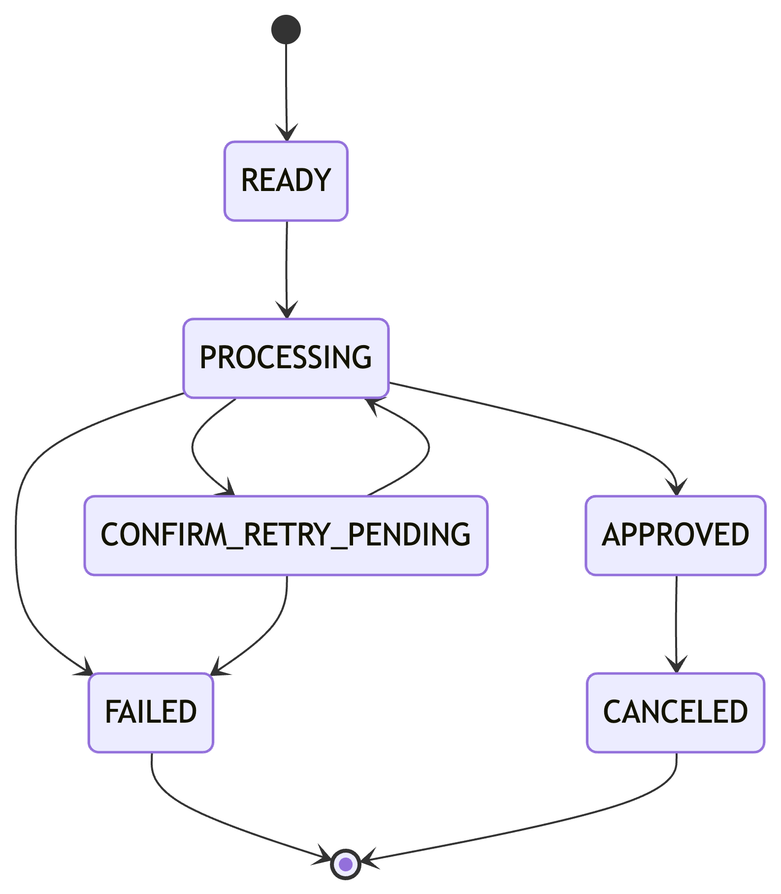

| 상태                      | 의미             |
|-------------------------|----------------|
| `READY`                 | 결제 승인 대기       |
| `PROCESSING`            | PG 승인 처리 중     |
| `APPROVED`              | 승인 완료          |
| `FAILED`                | 승인 실패          |
| `CONFIRM_RETRY_PENDING` | 결과 불명확, 재시도 대기 |
| `CANCELED`              | 결제 취소 또는 환불 반영 |

### 금지 전이

```text
READY -> APPROVED
APPROVED -> FAILED
FAILED -> APPROVED
CANCELED -> APPROVED
```

## 10. RefundStatus - v1

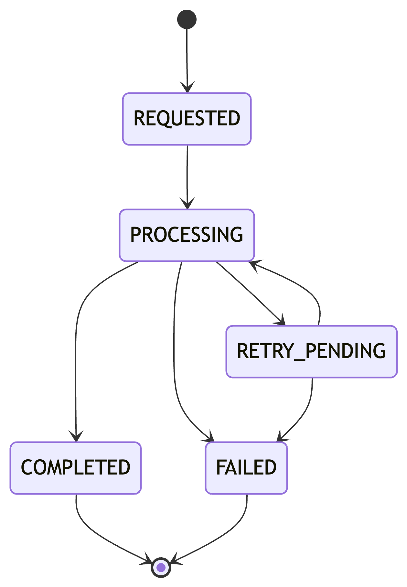

| 상태              | 의미         |
|-----------------|------------|
| `REQUESTED`     | 환불 요청 접수   |
| `PROCESSING`    | PG 취소 처리 중 |
| `COMPLETED`     | 환불 완료      |
| `FAILED`        | 환불 실패      |
| `RETRY_PENDING` | 재시도 대기     |

## 11. LedgerTransactionStatus - v1

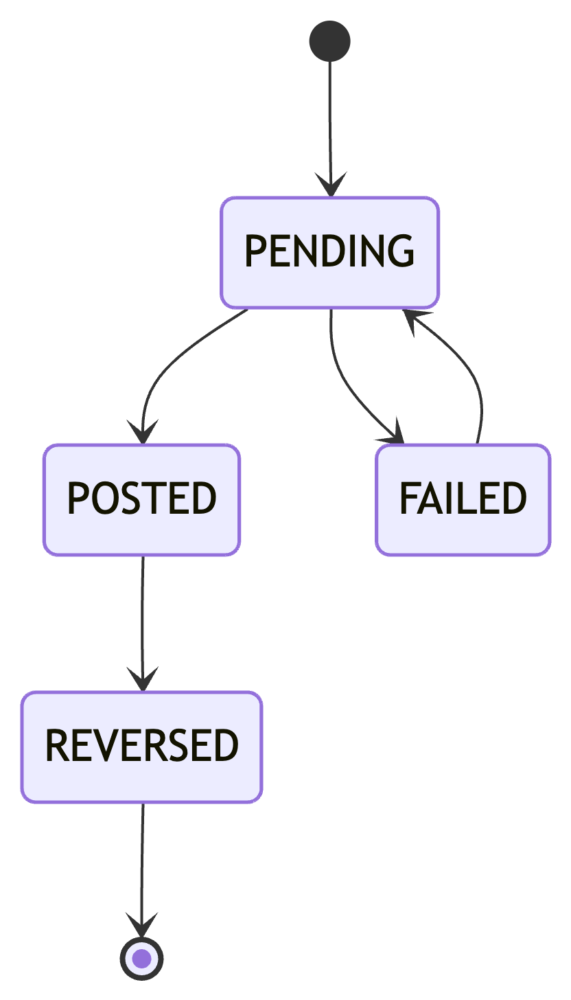

| 상태         | 의미          |
|------------|-------------|
| `PENDING`  | 기록 대기       |
| `POSTED`   | 기록 완료       |
| `FAILED`   | 기록 실패       |
| `REVERSED` | 보정 기록 생성 완료 |

## 12. OutboxEventStatus - v1

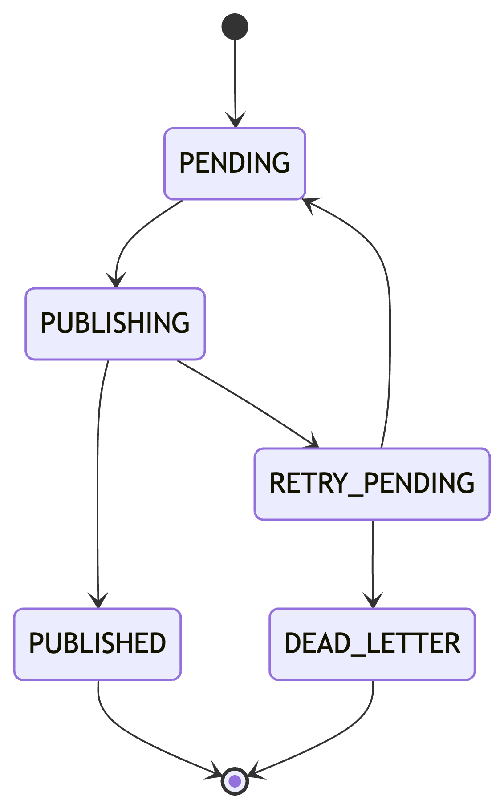

| 상태              | 의미       |
|-----------------|----------|
| `PENDING`       | 발행 대기    |
| `PUBLISHING`    | 발행 중     |
| `PUBLISHED`     | 발행 완료    |
| `RETRY_PENDING` | 재시도 대기   |
| `DEAD_LETTER`   | 수동 개입 필요 |

## 13. RetryTaskStatus - v1

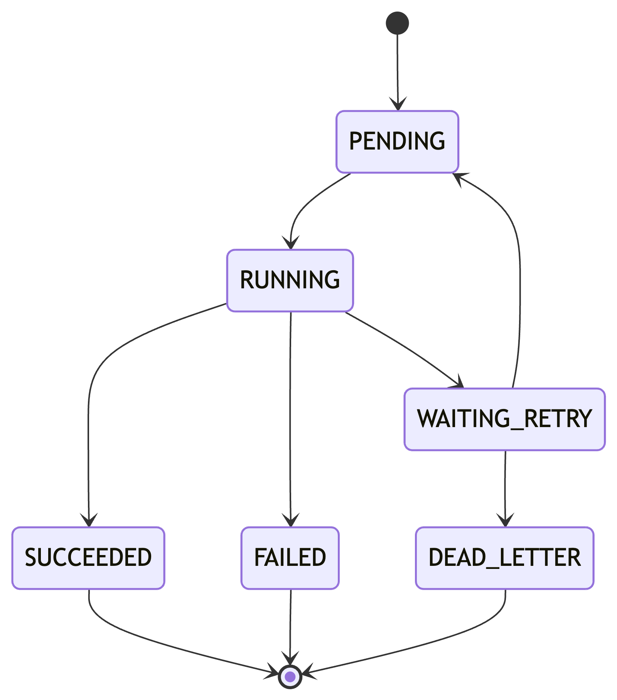

| 상태              | 의미       |
|-----------------|----------|
| `PENDING`       | 실행 대기    |
| `RUNNING`       | 실행 중     |
| `SUCCEEDED`     | 성공       |
| `WAITING_RETRY` | 재시도 대기   |
| `FAILED`        | 실패 확정    |
| `DEAD_LETTER`   | 수동 개입 필요 |